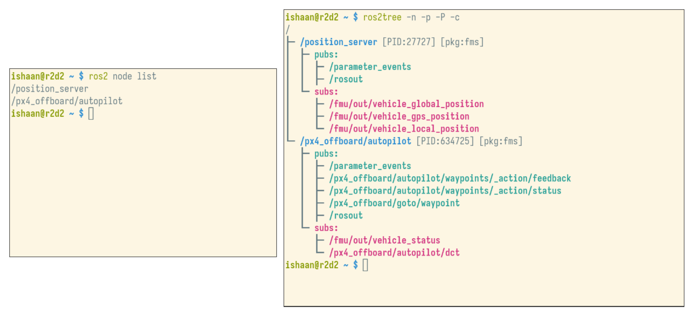

# ros2tree

A set of Python cli tools for ROS 2, inspired by the [tree](https://wikipedia.org/wiki/Tree_(command)) command. Tested on ROS Humble on Ubuntu 22.04.

## Setup
```bash
# clone the repo
git clone https://github.com/ishaanbhimwal/ros2tree.git && cd ros2tree

# make the scripts executable
chmod +x ros2tree.py ros2tree_node.py ros2tree_topic.py

# install into /usr/local/bin
sudo install -m 0755 ros2tree.py /usr/local/bin/ros2tree
sudo install -m 0755 ros2tree_node.py /usr/local/bin/ros2tree_node
sudo install -m 0755 ros2tree_topic.py /usr/local/bin/ros2tree_topic
```

## Usage
- `ros2tree` is a wrapper that exposes subcommands. one can also run `ros2tree_node` and `ros2tree_topic` directly.

```bash
ros2tree -h
# or
ros2tree_node
# or
ros2tree_topic
```

## Examples
```bash
ros2tree -n -p -P -c # view nodes, show pkg, show PID, colorize output
```




```bash
ros2tree -t -c -m # view topics, colorize output, show msg type
```


## Todo
- Add service script
- Release as a [ROS pkg](https://docs.ros.org/en/kilted/How-To-Guides/Releasing/Releasing-a-Package.html)
